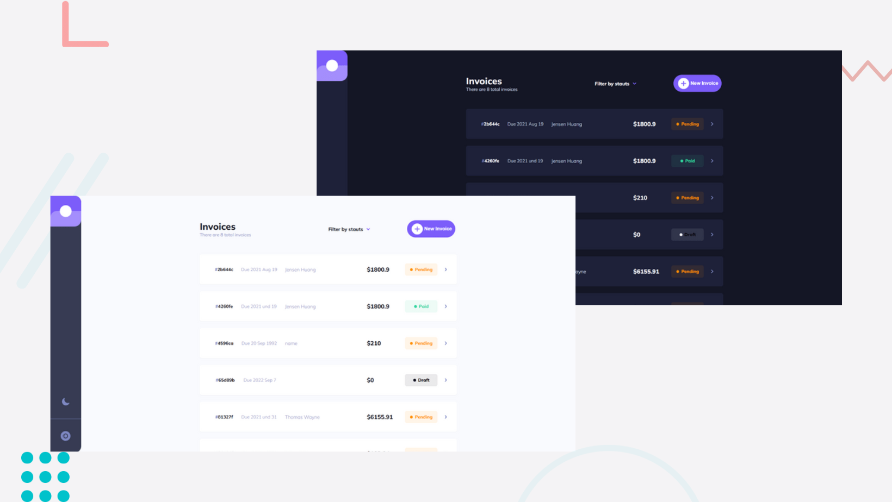

# Invoice App - Frontend Mentor

## Intro
Thank you for checking out my solution to the [invoice app challenge](https://www.frontendmentor.io/challenges/invoice-app-i7KaLTQjl) from Frontend Mentor. 

## Overview
Users should be able to:

- View the optimal layout for the app depending on their device's screen size ✅
- See hover states for all interactive elements on the page ✅
- Create, read, update, and delete invoices ✅
- Receive form validations when trying to create/edit an invoice ✅
- Save draft invoices, and mark pending invoices as paid ✅
- Filter invoices by status (draft/pending/paid) ✅
- Toggle light and dark mode ✅
- Bonus: Keep track of any changes, even after refreshing the browser (localStorage could be used  for this if you're not building out a full-stack app) ✅

## Live URl 👀
Invoice app   [link](https://invoices-tracker-app.netlify.app/)

**Note**    <small style="color: #e0e0e0">*I am using Netlify to deploy this app, so If the link is not working, try to use VPN.*
</small>  

## Built with

- Vue.js 
- Vuex
- Sass 
- UUID (to generate unique ids)

## Things I Learned

This is my first vue application All I want from developing this app is to practice Vue features ex: Options API, Vuex, slots, animation, routing...

I am trying to learn and apply the best practices. I don't know how clean or reusable my code is and I might have come up with my own way of doing things here and there. So feel free to explore the code and write your feedback.

## Reach me
Linkedin [Mariam Ibrahim](https://www.linkedin.com/in/mariam11ibrahim/)

